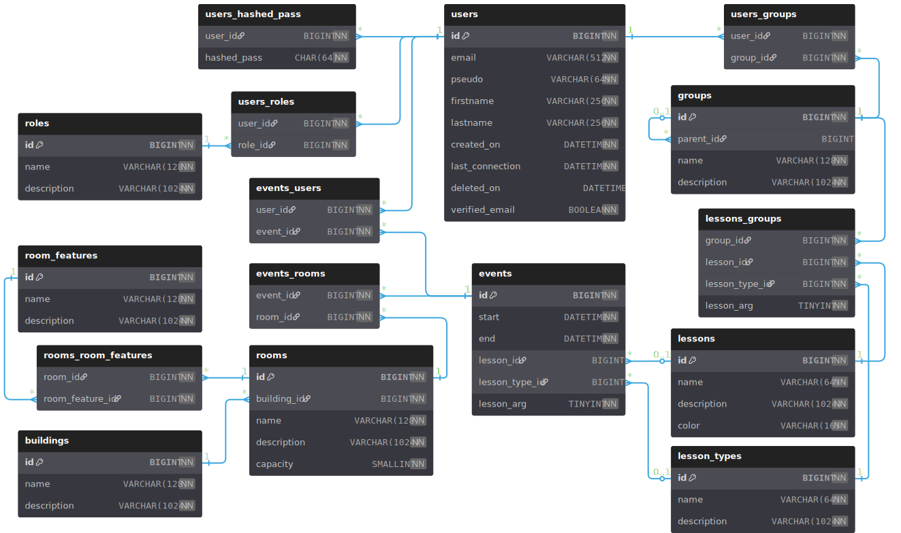
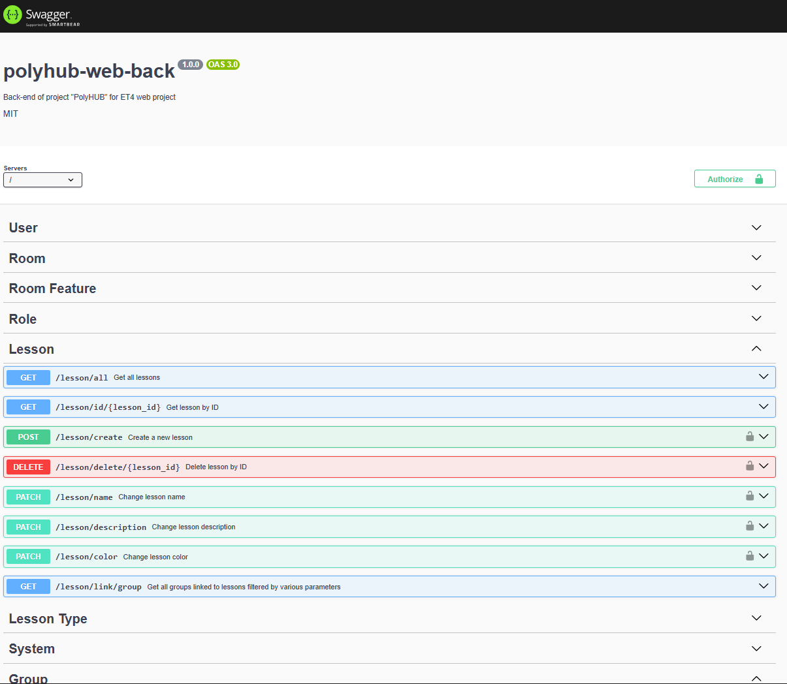
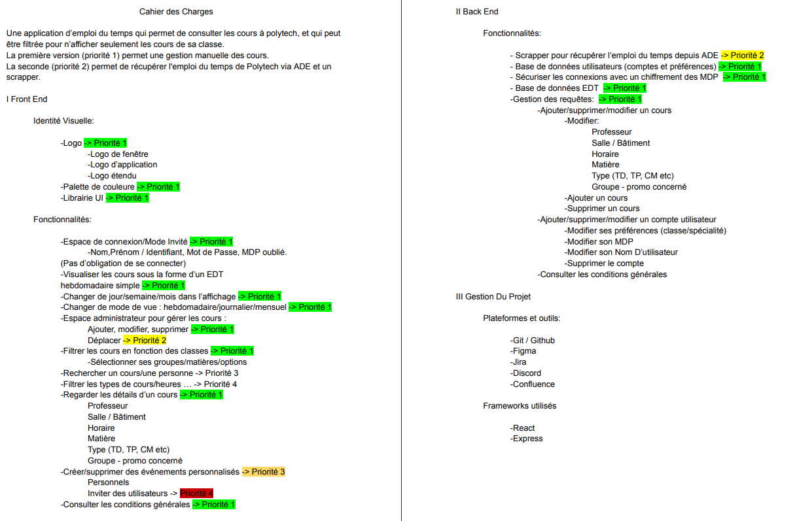
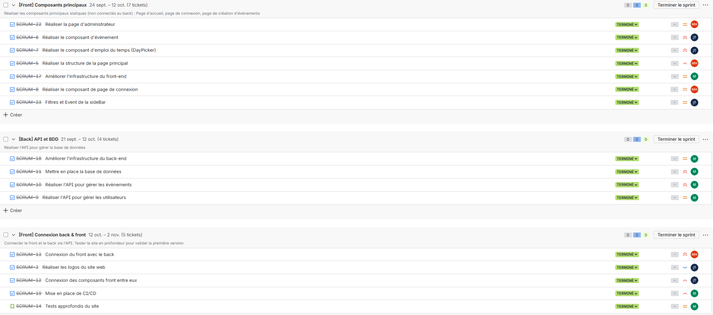
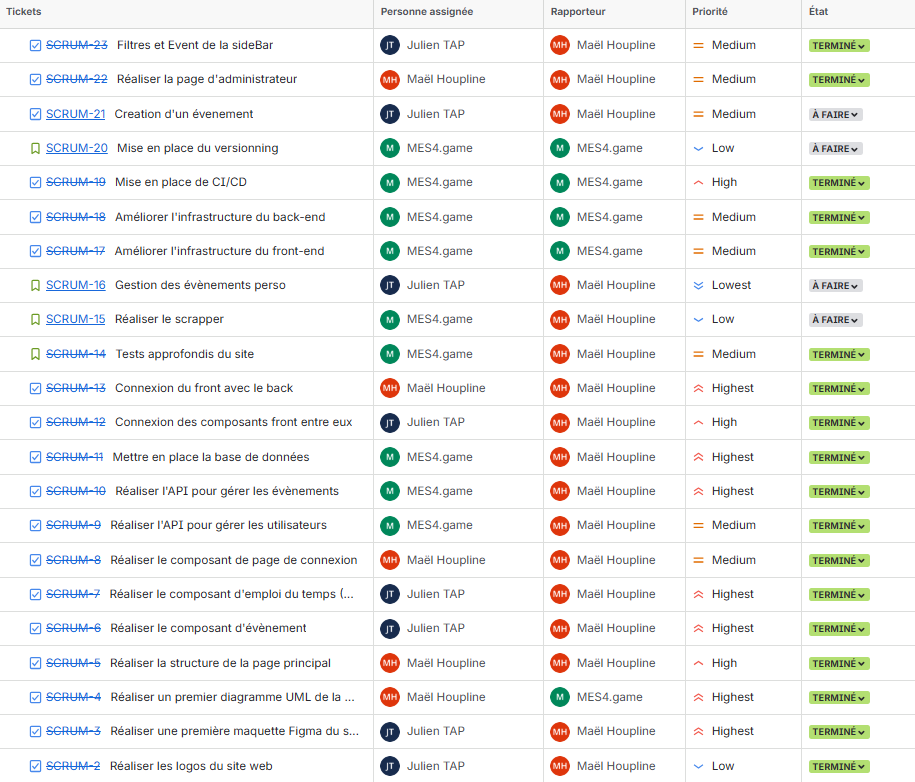

## 📄 Rapport de Projet : PolyHUB - L'Emploi du Temps Étudiant Réinventé

### **Membres de l'Équipe :**
- **Maxime DAUPHIN** (Responsable Back-end & Infrastructure)
- **Julien TAP** (Responsable Design & Front-end)
- **Maël HOUPLINE** (Responsable Front-end & Liaison)

---

## Table des Matières

- [1. Contexte : Présentation et Mise en Situation du Projet](#1-contexte--présentation-et-mise-en-situation-du-projet)
- [2. Coordination & Planification](#2-coordination--planification)
- [3. Description du Développement](#3-description-du-développement)
- [4. Critique et Bilan](#4-critique-et-bilan)
- [5. Auto-reflection](#5-auto-reflection)
- [6. Conclusion](#6-conclusion)
- [7. Bibliographie](#7-bibliographie)
- [8. Annexes](#8-annexes)

---

## 1. Contexte : Présentation et Mise en Situation du Projet

### **🎯 But du Projet**

Le projet **PolyHUB** a pour objectif principal de concevoir et de développer une application web moderne et ergonomique pour la consultation des **emplois du temps (EDT)** étudiants. L'ambition est de remplacer l'outil actuellement utilisé par l'école, jugé obsolète et peu pratique par l'ensemble du corps étudiant.

### **💡 Motivation / Choix du Sujet**

Le choix de développer PolyHUB est motivé par un **besoin utilisateur clair et unanime**. L'outil d'EDT existant au sein de l'établissement est source de frustration pour les étudiants en raison de son interface utilisateur difficile et de ses problèmes de fiabilité. En proposant PolyHUB, notre équipe vise à :
1.  **Améliorer significativement l'expérience utilisateur** (UX) des étudiants.
2.  **Fournir à l'école une solution alternative** potentiellement plus économique, plus performante et mieux adaptée à ses besoins spécifiques.
3.  **Proposer une solution durable** à une application mobile développée par un ancien élève, désormais plus maintenu et tombé dans l'obsolescence.

Ce projet représente un **investissement à forte valeur ajoutée** qui bénéficie directement à la communauté étudiante tout en offrant à l'établissement une vitrine technologique moderne et une solution logicielle sur mesure.

---

## 2. Coordination & Planification

### **👥 Répartition des Tâches**

Le projet a été mené par une équipe de trois membres, chacun avec un rôle bien défini pour garantir une efficacité maximale :

| Membre | Rôle Principal | Responsabilités Clés |
| :--- | :--- | :--- |
| **Maxime DAUPHIN** | Responsable Back-end & Infrastructure | Architecture Back-end, Base de données (MySQL), Déploiement Docker, Structure des dépôts (Front/Back). |
| **Julien TAP** | Responsable Design & Front-end | Conception graphique (UX/UI), Intégration Front-end (React/Shadcn), Respect de l'identité visuelle. |
| **Maël HOUPLINE** | Responsable Front-end & Liaison | Développement Front-end (Composants, Logique), Connexion et communication Front/Back (API), Gestion des états. |

### **📑 Cahier des Charges (Aperçu Simplifié)**

| Catégorie | Exigence Fonctionnelle | Exigence Technique |
| :--- | :--- | :--- |
| **Affichage** | Consultation de l'EDT par semaine, jour, groupe. | Temps de chargement inférieur à 2 secondes. |
| **Ergonomie** | Interface **responsive** et intuitive. | Utilisation de **Shadcn-UI** et **Tailwind CSS**. |
| **Données** | Mise à jour fiable et sécurisée des données d'EDT. | API RESTful avec **Express/TypeScript**, base **MySQL**. |
| **Déploiement** | Déploiement automatisé et conteneurisé. | Images **Docker** publiées sur **Docker Hub**. |

### **🗓️ Calendrier d'Avancement**

Le projet s'est déroulé sur une période s'étendant du **14 septembre au 12 novembre**.

| Période | Tâches Principales | État Réel | Points Clés (Réel) |
| :--- | :--- | :--- | :--- |
| **Semaine 1-2** (14/09 - 27/09) | **Phase d'Apprentissage & Setup** : Création des dépôts GitHUB, Design initial (Figma). | Complétée avec quelques jour de retard. | Choix définitif de l'architecture **monorepo virtuel** (dépôts séparés). |
| **Semaine 3-5** (28/09 - 18/10) | **Structure des dépôts**, **CI/CD** & **Base UI Front** (Structure, Composants Shadcn). | Complétée avec plusieurs jours de retard. | Difficulté initiale dans la configuration des dépôts et des CI/CD. |
| **Semaine 6-8** (19/10 - 08/11) | **Développement Back-end** (API EDT, connexion DB) & **Intégration Front-end** (Vue calendrier, filtres). | Complétée avec plusieurs jours de retard. | Grande avancée dans le dévelopement. |
| **Semaine 9** (09/11 - 12/11) | **Liaison Front/Back** & **Tests finaux**. | Complétée à temps. | Mise en place du site web final sur un VPS. |

---

## 3. Description du Développement

### **🛠️ Choix Technologiques et Justifications**

Le projet repose sur une architecture moderne de type **full-stack JavaScript/TypeScript**, conteneurisée via **Docker**.

| Composant | Technologie(s) Choisie(s) | Justification du Choix |
| :--- | :--- | :--- |
| **Front-end** | **React** (avec **TypeScript**), **Tailwind CSS**, **shadcn-UI** | **React** pour sa performance et son écosystème mature. **Tailwind** pour un développement CSS rapide et maintenable. **shadcn-UI** pour des composants réutilisables, accessibles et modernes. |
| **Back-end** | **Express** (avec **TypeScript**), **Swagger** & **TSOA** | **Express** pour un socle d'API REST robuste. **TypeScript** pour la sécurité et la maintenabilité du code. **TSOA/Swagger** pour générer automatiquement la documentation et valider les schémas, assurant la cohérence Front/Back. |
| **Stockage** | **MySQL** | Base de données relationnelle éprouvée, idéale pour structurer les données tabulaires (Étudiants, Cours, Salles, Groupes) de l'emploi du temps. |
| **Infrastructure** | **Docker** & **Docker Hub** | Conteneurisation pour garantir un environnement d'exécution **uniforme** et des déploiements **fiables** et **rapides** (CI/CD). |

### **🏗️ Architecture de Développement et Processus**

Nous avons opté pour la **séparation des dépôts GitHub** (un pour le Front-end, un pour le Back-end) afin de :
* **Isoler les configurations et dépendances** : Réduire les conflits et simplifier la gestion de chaque stack.
* **Optimiser la CI/CD** : Définir des workflows spécifiques et plus performants pour chaque partie du code.

### **💾 Stockage : Modèle Relationnel (MySQL)**

La base de données MySQL stocke les informations essentielles à l'EDT. Le modèle relationnel s'articule autour du schéma suivant :

### **✅ Validation et Tests**

* **Validation du Schéma** : L'utilisation de **TSOA** sur le Back-end assure une **validation automatique** des requêtes et réponses API (schémas et types), réduisant considérablement les erreurs de transmission de données entre le Front et le Back.
* **Tests Manuels** : Des tests manuels réguliers par les trois membres ont permis de valider l'interface utilisateur et la liaison Front-Back.

### **✨ Aperçu de l'API Back-end**

### **✨ Aperçu du Front-end**

TODO

---

## 4. Critique et Bilan

### **📊 État des Lieux de la Réalisation**

Le projet **PolyHUB** a atteint la majorité de ses objectifs fonctionnels décrits dans le cahier des charges. Nous avons réussi à déployer une application *full-stack* conteneurisée avec un design moderne et une API solide.

* **Points Positifs (Forces)** :
    * **Qualité du Code et Stack Technique** : L'utilisation de **TypeScript** et de **shadcn-UI** a permis de produire un code plus robuste et une interface soignée, renforcé par l'utilisation du **linter ESLint** garantissant que le code suit les règles de bonne pratique de la programmation.
    * **Processus CI/CD Avancé** : L'automatisation de la création de tags, releases et la publication des images Docker sur merge a été un succès, garantissant un déploiement rapide et fiable.
    * **API Documentée** : L'intégration de **Swagger/TSOA** a rendu l'API auto-documentée et a grandement facilité l'intégration Front-Back.
    * **Image Docker Publiée** : Les images Docker pour le Front-end, Back-end et la base de données sont publiées sur Docker Hub, prêtes à être déployées.

* **Points Négatifs (Faiblesses / Retard)** :
    * **Retard de Planification** : Le projet a accumulé un retard (principalement lié à la configuration initiale de l'infrastructure et la phase d'apprentissage, mais également dû à des facteurs externes tel que le projet de C++ avec une échéance similaire).
    * **Absence du scrapper**: Nous n'avons pas eu le temps de déveloper le scrapper pour récupérer les donéees depuis le site actuel.
    * **Tests de Couverture** : Des tests unitaires pourraient être ajouté.

### **🚧 Difficultés Rencontrées et Solutions**

| Difficulté | Solution Apportée ou Piste d'Amélioration |
| :--- | :--- |
| **Configuration Infrastructure** | **Solution** : Mieux gérer le temps imparti et ne pas faire trop complexe si le temps n'est pas suffisant. |
| **Liaison Front-Back** | **Solution** : Une communication plus clair afin de garantir que l'on se base sur la même structure de données (pas celle de la base de données, mais celle de l'API). Fournir des appels API plus complexes et adaptés à l'architecture de données du front. |
| **Retard Global** | **Piste d'Amélioration** : Allouer une **marge de sécurité** plus importante dans la planification initiale pour les phases d'apprentissage technologique et la prise en compte des facteurs externes. |

### **✨ Améliorations Futures**

* **Fonctionnalité d'Abonnement (iCal)** : Permettre aux utilisateurs d'exporter ou de s'abonner à leur EDT via un lien iCal.
* **Ajout du scrapper**: Ajout d'un scrapper ou d'une méthode pour importer de gros volume de données en une fois.
* **Amélioration de la Couverture de Tests** : Déployer des outils de tests d'interface utilisateur (ex : Cypress ou Playwright) pour le Front-end.
* **Amélioration de la Responsivité** : Permettre au site internet de s'adapter à toutes formes d'écran, afin d'être une alternative efficace pour les utilisateurs de mobile ou tablette.

---

## 5. Auto-reflection

* **Maxime DAUPHIN**
    * **Auto-réflexion** : Ce projet m'a permis de beaucoup progresser dans mon utilisation des technologies modernes (**GitHub**/ **Docker**) et de mieux travailler en équipe. Il m'a aussi fait remarquer que je me prenais trop la tête sur certains aspects du développement. En voulant faire quelque chose de parfait, j'ai pris du retard sur le projet, et cette perte de temps n'aura pas été utile au projet.
    * **Utilisation de l'IA** : Lors de ce projet, j'ai utilisé l'IA de Google **«Gemini»**. Lorsque je n'arrivais pas à trouver une réponse à un problème dans la documentation ou sur **Stack Overflow**, elle m'a été en partie utile. En effet, l'IA arrivait à me trouver de potentiels problèmes, mais ces derniers n'étaient pas forcément la cause de l'erreur, et même des fois n'étaient pas des problèmes. Mais même pour les problèmes qu'elle trouvait, elle arrivait rarement à me donner une version corrigée fonctionnelle, mais cela m'aidait à trouver de nouvelles pistes de rechercheréflexion.
    * **Compétences** :
        * **Complexité & Problème** : Ayant déjà réalisé de petits projets pour un club, j'avais déjà un niveau de base. Le projet m'a notamment permis de m'améliorer dans l'élaboration d'une structure plus claire et modulaire.
        * **Modèle de données & Back-end** : De même, le projet m'a permis d'améliorer mes compétences en modélisation de données et en conception d'API **RESTful**, notamment grâce à l'utilisation de **TSOA** pour la validation automatique des schémas.
        * **Front-end & UX** : Bien que mon rôle principal nait pas été le Front-end, j'ai acquis une meilleure compréhension de la liaison entre le Front-end et le Back-end, ainsi que des principes de base de l'UX, grâce à l'initialisation de la structure Front-end.
        * **Qualité du code** : J'ai appris l'importance d'écrire un code propre et maintenable, en utilisant **TypeScript** pour renforcer la sécurité des types et réduire les erreurs. J'ai également intégré des pratiques de revue de code pour améliorer la qualité globale du projet, comme la mise en place de linters.
        * **Tests & Validation** : J'ai découvert l'importance des tests automatisés et de la validation des schémas API pour garantir la fiabilité du système. L'utilisation de **TypeScript**, **TSOA** et **ESLint** m'a aidé à minimiser les erreurs. J'ai commencé à me renseigner sur les tests unitaires, bien que je n'aie pas encore eu l'occasion de les implémenter pleinement dans ce projet.
        * **Cahier des charges & Trajectoire** : J'ai appris à élaborer un cahier des charges clair et à suivre une trajectoire de développement structurée, en adaptant le plan initial en fonction des défis rencontrés.
        * **Veille & Positionnement** : J'ai amélioré mes compétences en veille technologique, en me tenant informé des dernières tendances et outils dans le développement web, ce qui m'a permis de faire des choix technologiques éclairés pour le projet.
        * **Réflexivité & Argumentation** : J'ai développé ma capacité à réfléchir de manière critique sur mes choix techniques et à argumenter mes décisions, en tenant compte des besoins du projet et des contraintes techniques.
        * **Clarté & Impact** : J'ai appris à communiquer de manière claire et concise, tant à l'écrit qu'à l'oral, en expliquant les aspects techniques du projet à des non-spécialistes.
        * **Planification & Suivi** : J'ai renforcé mes compétences en gestion de projet, en planifiant les tâches, en suivant l'avancement et en ajustant les priorités en fonction des imprévus.
        * **DevOps & Cycle de vie** : J'ai acquis une compréhension plus approfondie des pratiques DevOps, notamment en ce qui concerne la conteneurisation avec **Docker** et l'automatisation des tests et des déploiements via **CI/CD**.

* **Maël HOUPLINE**
  * TODO

* **Julien TAP**
  * TODO

---

## 6. Conclusion

**PolyHUB** est bien plus qu'un simple projet étudiant ; c'est une **réponse directe à un besoin réel et non satisfait** de la communauté de notre école. Grâce à une architecture technique moderne et à une séparation claire des rôles (Back-end/Infra par **Maxime**, Design/Front par **Julien**, Front/Liaison par **Maël**), nous avons pu concevoir une application performante, fiable et agréable à utiliser.

Malgré de légers retards liés à la courbe d'apprentissage de technologies pointues, la qualité du produit final et l'automatisation du déploiement (Docker/CI/CD) démontrent la **maturité technique** de l'équipe. PolyHUB est désormais prêt à être présenté comme une **alternative crédible** à l'outil existant, représentant une **opportunité stratégique** pour l'école et un service précieux pour ses étudiants.

---

## 7. Bibliographie

- [PolyHUB - Front-end Repository](https://github.com/MES4game/POLYHUB-WEB-FRONT)
- [PolyHUB - Back-end Repository](https://github.com/MES4game/POLYHUB-WEB-BACK)
- [Docker Hub - PolyHUB Images](https://hub.docker.com/u/mes4game)
- [TypeScript Documentation](https://www.typescriptlang.org/docs/)
- [React Documentation](https://react.dev/learn)
- [shadcn-ui Documentation](https://ui.shadcn.com/docs/installation)
- [Express Documentation](https://expressjs.com/en/5x/api.html)
- [MySQL Documentation](https://dev.mysql.com/doc/refman/8.4/en/)
- [Docker Documentation](https://docs.docker.com/)
- [Swagger Documentation](https://swagger.io/docs/)
- [TSOA Documentation](https://tsoa-community.github.io/docs/)
- [Stack Overflow](https://stackoverflow.com/)
- [Gemini](https://gemini.google.com/): Pour la résolution de problèmes techniques spécifiques, notamment liés à la configuration CI/CD et les problèmes non documentés dans les bibliothèques utilisées ou Stack Overflow.

---

## 8. Annexes

* Annexe 1 : Cahier des Charges Complet

* Annexe 2 : Jira Backlog et Suivi des Tâches

